# Einstein Recommendations <!-- omit in toc -->

This page aims to make using Einstein recommendations a little easier by adding a few explanations around how to use it in a modern setup.

- [Collect Code](#collect-code)
  - [Note to developers](#note-to-developers)
  - [Initialize the library](#initialize-the-library)
    - [Collect Code on page load](#collect-code-on-page-load)
    - [Asynchronous Collect Code](#asynchronous-collect-code)
    - [Asynchronous Collect Code with preloading](#asynchronous-collect-code-with-preloading)
  - [Debug your tracking solution](#debug-your-tracking-solution)
  - [Tracking and other Collect Code features](#tracking-and-other-collect-code-features)
    - [Disable tracking](#disable-tracking)
    - [Identify Business Unit for Tracking](#identify-business-unit-for-tracking)
    - [Identify current user](#identify-current-user)
      - [Attribute Affinity](#attribute-affinity)
    - [Track Page Views: trackPageView](#track-page-views-trackpageview)
    - [Track Items in Cart: trackCart](#track-items-in-cart-trackcart)
    - [Track Purchases / Conversions: trackConversion](#track-purchases--conversions-trackconversion)
      - [Tracking overhead cost](#tracking-overhead-cost)
    - [Track Custom Event: trackEvent](#track-custom-event-trackevent)
    - [Track User Wishlist: trackWishList](#track-user-wishlist-trackwishlist)
- [Update Catalog](#update-catalog)
  - [Via Collect Code](#via-collect-code)
  - [Update Catalog via API](#update-catalog-via-api)
- [Predictive Intelligence (PI) Data Extensions](#predictive-intelligence-pi-data-extensions)
- [Einstein Email Recommendations](#einstein-email-recommendations)
- [Einstein Web Recommendations](#einstein-web-recommendations)
  - [Embedding Web Recommendations](#embedding-web-recommendations)
    - [How the recommender knows who the current user is](#how-the-recommender-knows-who-the-current-user-is)
    - [Enhancing recommendation results](#enhancing-recommendation-results)
    - [Embed via JSON](#embed-via-json)
      - [JSON Example responses](#json-example-responses)
    - [Embed via JavaScript ("HTML")](#embed-via-javascript-html)
      - [JavaScript/HTML example code](#javascripthtml-example-code)
  - [Debugging Web Recommendations](#debugging-web-recommendations)
- [Embedding Collect Code via Google Tag Manager (GTM)](#embedding-collect-code-via-google-tag-manager-gtm)
  - [Loading the GTM library](#loading-the-gtm-library)
  - [Loading collect.js via GTM](#loading-collectjs-via-gtm)
    - [GTM: Developer Playground](#gtm-developer-playground)
  - [Logging events via GTM](#logging-events-via-gtm)
    - [Identify current user via GTM](#identify-current-user-via-gtm)
  - [Debugging / Previewing your GTM setup](#debugging--previewing-your-gtm-setup)
  - [Publishing your changes](#publishing-your-changes)
  - [Events mapping: Collect Code to GA4 Retail/Ecommerce](#events-mapping-collect-code-to-ga4-retailecommerce)

## Collect Code

> Official documentation: [help.salesforce.com](https://help.salesforce.com/articleView?id=mc_ctc_collect_code.htm&type=5)

The default sample codes all assume a page load is happening whenever something needs to be tracked. However, the `collect.js` library is actually capable of being loaded asynchronously and can be used in a single-page-application (SPA) environment as well, similarly to [Google's analytics.js](https://developers.google.com/analytics/devguides/collection/analyticsjs).

### Note to developers

While the offical sample code snippets might lead you to believe that you are looking at an **Array**, that is in fact only half true. The variable `_etmc` gets rewritten by `collect.js` to become an object that happens to also expose a method named `push()`. Their base snippet in fact assumes that `collect.js` has been loaded synchronously before you execute your first call to `push()`. Essentially, the first Array-element is the name of an internal method of collect.js that gets executed.

For more details, have a look at the [collect.js](collect-code/default/collect.js) library itself.

### Initialize the library

#### Collect Code on page load

_Quoting from [SFMC's documentation](https://help.salesforce.com/articleView?id=mc_ctc_install_collect_code.htm&type=5):_

The Collect Code should be placed just before the closing head tag and before any other Marketing Cloud code.

To initialize the tracking, do not forget to replace the two occurences of "INSERT_MID" with your actual BU's Member ID.

```html
<script src='//INSERT_MID.collect.igodigital.com/collect.js'></script>
```

This code should be placed directly below the `</head>` tag following the above tag.

```html
<script>
_etmc.push(['setOrgId', 'INSERT_MID']);


// then execute tracking, e.g.:
// _etmc.push(['trackPageView']);
</script>
```

Download: [Default sample code](https://github.com/JoernBerkefeld/SFMC-Cookbook/blob/master/einstein/recommendation/collect-code/default/collect-code.defaut.html)

#### Asynchronous Collect Code

The Collect Code tag should be added near the top of the `<head>` tag and before any other script or CSS tags.

To initialize the tracking, do not forget to replace the two occurences of "INSERT_MID" with your actual BU's Member ID.

```html
<!-- Einstein Collect Code -->
<script>
(function(e,t,c,n,o,s,a){e[o]=e[o]||[],s=t.createElement(c),a=t.getElementsByTagName(c)[0],s.async=1,s.src=n,a.parentNode.insertBefore(s,a)})(window,document,'script','//INSERT_MID.collect.igodigital.com/collect.js','_etmc');

// always run this line once, followed by what you actually want to track; can be run programmatically in single-page-applications
_etmc.push(['setOrgId', 'INSERT_MID']);


// then execute tracking, e.g.:
// _etmc.push(['trackPageView']);
</script>
<!-- End Einstein Collect Code -->
```

Download: [Async sample code](https://github.com/JoernBerkefeld/SFMC-Cookbook/blob/master/einstein/recommendation/collect-code/collect-code.async.html)

The above code does four main things:

1. Creates a `<script>` element that starts asynchronously downloading the collect.js JavaScript library from `https://INSERT_MID.collect.igodigital.com/collect.js`
2. Initializes a global `_etmc` function that allows you to schedule commands to be run once the collect.js library is loaded and ready to go.
3. Adds a command to the `_etmc` command queue to _set the Org ID_ to your Business Unit Member ID. This is required to ensure your tracking data ends up in the correct Business Unit.
4. Adds another command to the `_etmc` command queue to track a [pageview](https://help.salesforce.com/articleView?id=mc_ctc_track_page_view.htm&type=5) to Einstein for the current page.

Custom implementations may require modifying the last line of the above code snippet (the trackPageView command) or adding additional code to capture more interactions. However, you should not change the code that loads the collect.js library or initializes the `_etmc.push()` command queue function. Refer to the [official docs](https://help.salesforce.com/articleView?id=mc_ctc_collect_code.htm&type=5) for details on available options.

#### Asynchronous Collect Code with preloading

The above Collect Code snippet will ensure things work across all browsers but it has the disadvantage of not allowing modern browsers to preload the script.

The alternative async tag below adds support for preloading, which will provide a small performance boost on modern browsers, but can degrade to synchronous loading and execution on IE 9 and older mobile browsers that do not recognize the async script attribute. Only use this tag configuration if your visitors primarily use modern browsers to access your site.

To initialize the tracking, do not forget to replace the two occurences of "INSERT_MID" with your actual BU's Member ID.

```html
<!-- Einstein Collect Code -->
<script>
window._etmc=window._etmc||[];

_etmc.push(['setOrgId', 'INSERT_MID']);


// then execute tracking, e.g.:
// _etmc.push(['trackPageView']);
</script>
<script async src='//INSERT_MID.collect.igodigital.com/collect.js'></script>
<!-- End Einstein Collect Code -->
```

Keep the above in the `<head>` section of your code.

Download: [Async preload sample code](https://github.com/JoernBerkefeld/SFMC-Cookbook/blob/master/einstein/recommendation/collect-code/collect-code.async-preload.html)

### Debug your tracking solution

Use the following to activate `console.log` outputs whenever data is send to the server.

```javascript
// enable debug output
_etmc.debug = true;
```

Alternatively, look for loaded images in the Network tab of your browser. The calls go to "files" (endpoints) with the name of your method calls, though rewritten to [Snake Case](https://en.wikipedia.org/wiki/Snake_case).

### Tracking and other Collect Code features

There are a lot of options available from the Collect Code library, available via the `_etmc.push()` method. Only options starting on "track" and "update" actually result in a callout to the server. The "set" and "doNotTrack" methods are mere settings that need to be executed before those.

| Method |Description |
| -- | -- |
| [doNotTrack](#disable-tracking) | Deactivate tracking on the current page. More info below. |
| setFirstParty | Allows you to send tracking data to a server other than the default, e.g. to proxy the data through your own server. Use together with one of the `track...` methods |
| setInsecure | Use together with `setFirstParty` to track data via a non-secure proxy server. Only works if the current website was not opened securely either; use together with one of the `track...` methods |
| [setOrgId](#identify-business-unit-for-tracking) | set your BUs MID; use together with one of the `track...` methods |
| [setUserInfo](#identify-current-user) | allows to send in an object with user data `{email:'', custom:'abc'}`; use together with one of the `track...` methods |
| [trackCart](#track-items-in-cart-trackcart) | Log items added or removed from a contact's cart |
| [trackConversion](#track-purchases--conversions-trackconversion) | Log details about a contact’s purchase |
| [trackEvent](#track-custom-event-trackevent) | _Undocumented feature:_ Allows you to track custom events |
| [trackPageView](#track-page-views-trackpageview) | Log [content/product page](https://help.salesforce.com/articleView?id=mc_ctc_track_page_view.htm&type=5) views, [in-site search terms](https://help.salesforce.com/articleView?id=mc_ctc_track_in_site_search.htm&type=5) and [category views](https://help.salesforce.com/articleView?id=mc_ctc_track_category_view.htm&type=5). More info below |
| [trackRating](https://help.salesforce.com/articleView?id=mc_ctc_track_rating.htm&type=5) | Log a user's rating for an item on your website. |
| [trackWishlist](#track-user-wishlist-trackwishlist) | _Undocumented feature:_ Allows you to track multiple "shopping carts"-like lists in which users track future wishes |
| [updateItem](#via-collect-code) | This allows you to [update your product catalog](https://help.salesforce.com/articleView?id=mc_ctc_streaming_updates.htm&type=5). More info below. |

#### Disable tracking

Contrary to the [official docs](https://help.salesforce.com/articleView?id=mc_ctc_do_not_track.htm&type=5), just a single line is needed, which then literally deactivates `_etmc.push()` and therefore any other tracking calls that are issued afterwards on the current page. This should be executed on page load before other push-calls.

```javascript
// disable tracking for current page
_etmc.push(['doNotTrack']);
```

#### Identify Business Unit for Tracking

This is a required configuration step before tracking anything which allows the collect code to send the tracking data to the right business unit.

```javascript
_etmc.push(['setOrgId','INSERT_MID']);
```

#### Identify current user

Contrary to what the [official docs](https://help.salesforce.com/articleView?id=mc_ctc_set_user_info.htm) state, the only line required to define the user is this:

```javascript
_etmc.push(['setUserInfo', {'email': 'INSERT_EMAIL_OR_UNIQUE_ID'}]);

// run a generic trackPageView once to set cookies that are necessary for personalized Web Recommendations to show up
_etmc.push(['trackPageView']);
```

According to a well hidden part of the [documentation](https://help.salesforce.com/articleView?id=mc_anb_prerequisites_einstein_engagement_scoring.htm&type=5) Einstein Engagement Scoring actually supports for `INSERT_EMAIL_OR_UNIQUE_ID`:

- **Subscriber Key**, which can be implemented with a support request (**not tested yet**)
- **Subscriber ID**
- **Email address**
- **MD5 Hashed lowercase version of email address**

... as your subscriber identifier in Collect Tracking Code. Based on the source of collect.js, this should always be handed in as a value of `'email'`.

Thinking about using Einstein in Journey Builder it makes sense to align with something that Einstein can actually understand and map to existing contacts in SFMC.
However, there is the automatically created attribute group that links the PI_* Data Extensions to a Contact using the Email. Based on what I was able to find out, one should simply ignore that Attribute Group altogether.

On the other hand, if all you care about is showing Einstein powered recommendations, you simply have to ensure that you use the same string when you retrieve web/email recommendations that you previously used for tracking via collect code.

##### Attribute Affinity

This should theoretically boost catalog items that carry the same attribute (detail-field and value) defined as the current user.

> _[Quote](https://help.salesforce.com/articleView?id=mc_ctc_set_contact_attribute_affinity.htm&type=5):_ Match a contact attribute to a tagged catalog field to increase the subscriber's affinity for the value of that contact attribute. The amount of increase is less than what results from a purchase but more than the increase from a view.

```javascript
_etmc.push(['setUserInfo', {
    'email': 'INSERT_EMAIL_OR_UNIQUE_ID',
    'details': {
        'gender': 'female',
        'otherCustomAttribute', 'myValue'
    }
}]);
```

#### Track Page Views: trackPageView

The first element you pass in basically represents a method name which takes multiple variables. `trackPageView` accepts the following parameters alone or combined:

To track the view of a content or product, use this code:

| Key          | Value                   |
| ------------ | ----------------------- |
| `'item'`     | _Product code_ (String) |
| `'search'`   | _Search term_ (String)  |
| `'category'` | _Catgeory_ (String)     |

The most simple versions use **one** of the following lines

```javascript
// product page viewed
_etmc.push(['trackPageView', { 'item': 'INSERT_PRODUCT_CODE' }]);

// category viewed
_etmc.push(['trackPageView', { 'category': 'INSERT_CATEGORY' }]);

// search executed
_etmc.push(['trackPageView', { 'search': 'INSERT_SEARCH_TERM' }]);
```

But of course these can also be combined: If the user came to the page using your search you can optionally use the following extended snippet:

```javascript
_etmc.push(['trackPageView', { 'item': 'INSERT_PRODUCT_CODE','search': 'INSERT_SEARCH_TERM' }]);
```

#### Track Items in Cart: trackCart

This should be run each time a product is added or removed from the cart, the quantity is changed or when the purchase is finalized.

```javascript
_etmc.push(['trackCart', {
    'cart': [
        {
            'item': 'INSERT_ITEM',
            'quantity':  'INSERT_QUANTITY',
            'price': 'INSERT_PRICE',
            'unique_id': 'INSERT_UNIQUE_ID'
        },
        {
            'item': 'INSERT_ITEM',
            'quantity':  'INSERT_QUANTITY' ,
            'price': 'INSERT_PRICE' ,
            'unique_id': 'INSERT_UNIQUE_ID'
        }
    ]
}]);
```

**Definitions:**

| Key | Definition |
| -- | -- |
| `item`      | Matches the field mapped to **ProductCode** in the catalog. |
| `quantity`  | The number of items added for the particular SKU. |
| `price`     | The price at the time of adding an item to the cart. |
| `unique_id` | Matches the field mapped to the **SKUId** in the catalog. When these items match it ensures the exact record in the catalog, including all specific attributes like color and size, is tied to the cart rather than just the ProductCode |

**Important:** Always include the entire cart in this call because it will overwrite whatever was stored before. Therefore, in order to remove one row, simply pass in all other rows that were not deleted.

The [official docs](https://help.salesforce.com/articleView?id=mc_ctc_track_cart.htm&type=5) state that one should use the following to remove all cart line items at once:

```javascript
_etmc.push(['trackCart', { 'clear_cart': true } ]);
```

#### Track Purchases / Conversions: trackConversion

```javascript
_etmc.push(['trackConversion', {
    'cart': [
        {
            'item': 'INSERT_ITEM',
            'quantity':  'INSERT_QUANTITY',
            'price': 'INSERT_PRICE',
            'unique_id': 'INSERT_UNIQUE_ID'
        },
        {
            'item': 'INSERT_ITEM',
            'quantity':  'INSERT_QUANTITY',
            'price': 'INSERT_PRICE',
            'unique_id': 'INSERT_UNIQUE_ID'
        }
    ],
   // OPTIONAL PARAMETERS
   'details': {
       'AttributeName': 'Value'
    }
   // END OPTIONAL PARAMETERS
}]);
```

| Key          | Description                                                                           |
| ------------ | ------------------------------------------------------------------------------------- |
| `cart`         | same as for `trackCart`; [see above](#track-items-in-cart-trackcart) for more details |
| `order_number` | _mentioned in official docs but not actually supported_ |
| `discount`     | _mentioned in official docs but not actually supported_ |
| `shipping`     | _mentioned in official docs but not actually supported_ |
| `details`      | _optional: Given the similar format this could have something to do with affinity attributes but the effect remains unclear_ **TBC** |

##### Tracking overhead cost

> **Not actually working!**

The [official docs](https://help.salesforce.com/articleView?id=mc_ctc_track_conversion.htm&type=5) state that you can in fact track `order_number`, `discount` and `shipping` as separate fields and that those are then used to calculate the line item cost together with their respective overhead. While looking into collect.js however, those fields seem to get ignored when calling back to the server.

**What to do instead:** Simply calculate final prices on an order-line-item level before sharing it with the Collect Code. Shipping Cost have no bearing on the recommendation but if you have to track it, send it in as an order-line-item.

```javascript
// non-working example from official docs
_etmc.push(['trackConversion', {
    'cart': [
        {
            'item': '123',
            'quantity': '2',
            'price': '10.00',
            'unique_id': '123'
        }
    ],
    // OPTIONAL PARAMETERS
    'order_number': '123456', // fact check: not supported by collect.js
    'discount': '2.00', // fact check: not supported by collect.js
    'shipping': '5.00' // fact check: not supported by collect.js
    // END OPTIONAL PARAMETERS
}]);
```


#### Track Custom Event: trackEvent

From what collect.js shows, only `name` and `details` are actually send to the server. The field `details` is optional!

```javascript
_etmc.push(['trackEvent', {
    'name': 'INSERT_CUSTOM_EVENT_NAME',
    'details': {
        'gender': 'female',
        'otherCustomAttribute', 'myValue'
    }
}]);
```

This is untested code and hence further information will be added later once we've seen it in action.

#### Track User Wishlist: trackWishList

Allows you to store contact wishlists for items on your website.

```javascript
_etmc.push(['trackWishlist', {
    'items': ['INSERT_ITEM_1', 'INSERT_ITEM_2', 'INSERT_ITEM_3'],
    'skus': ['INSERT_UNIQUE_ID_1', 'INSERT_UNIQUE_ID_2', 'INSERT_UNIQUE_ID_3']
}]);
```

| Key         | Definition                                                  |
| ----------- | ----------------------------------------------------------- |
| `item`      | Matches the field mapped to **ProductCode** in the catalog. |
| `unique_id` | Matches the field mapped to the **SKUId** in the catalog.   |

According to the offical docs, handing in skus is optional but I haven't tested that. Make sure the 2 arrays have the same length as the first item in one list is mapped to the first in the other; the second to the second; and so on and so forth.

The contact’s wishlist data is replaced by each subsequent trackWishlist call. Therefore, make sure to always include the entire _current_ list and remove entries from the call that the user deleted from it.

## Update Catalog

There are various ways of updating the catalog in Einstein that come with their own advantages and disadvantages.

### Via Collect Code

> Source: [help.salesforce.com/articleView?id=mc_ctc_streaming_updates.htm](https://help.salesforce.com/articleView?id=mc_ctc_streaming_updates.htm&type=5)

It is actually possible to send in updates to your catalog via the collect code. This approach runs without authentication and is therefore up for being hacked. Treat it with caution. With that said, you cannot deactivate it AFAIK.

**Update a single item:**

```javascript
_etmc.push(['updateItem',
    {
    'item': 'INSERT_ITEM',
    'unique_id': 'INSERT_UNIQUE_ITEM_ID',
    'name': 'INSERT_ITEM_NAME_OR_TITLE',
    'url': 'INSERT_ITEM_URL',
    'item_type': 'INSERT_ITEM_TYPE',
    'INSERT_ATTRIBUTE_NAME': 'INSERT_ATTRIBUTE_VALUE'
    }
]);
```

**Update multiple items:**

```javascript
_etmc.push(['updateItem', [
    {
        'item': 'INSERT_ITEM',
        'unique_id': 'INSERT_UNIQUE_ITEM_ID',
        'name': 'INSERT_ITEM_NAME_OR_TITLE',
        'url': 'INSERT_ITEM_URL',
        'item_type': 'INSERT_ITEM_TYPE',
        'INSERT_ATTRIBUTE_NAME': 'INSERT_ATTRIBUTE_VALUE'
    },
    {
        'item': 'INSERT_ITEM',
        'unique_id': 'INSERT_UNIQUE_ITEM_ID',
        'name': 'INSERT_ITEM_NAME_OR_TITLE',
        'url': 'INSERT_ITEM_URL',
        'item_type': 'INSERT_ITEM_TYPE',
        'INSERT_ATTRIBUTE_NAME': 'INSERT_ATTRIBUTE_VALUE'
    }
]]);
```

### Update Catalog via API

> Source: [help.salesforce.com/articleView?id=mc_ctc_streaming_updates.htm](https://help.salesforce.com/articleView?id=mc_ctc_streaming_updates.htm&type=5)

This is in theory possible, however so far I haven't gotten it to work.

## Predictive Intelligence (PI) Data Extensions

`PI_ABANDONED_CART_EVENT` and `PI_ABANDONED_CART_ITEMS` will never have any data, according to a [Partner webinar from Salesforce](https://share.vidyard.com/watch/ufsSo83N4VaCSpZzxhS7Eo). They were "part of an earlier attempt" of the solution but are no longer in use - but nonetheless still created together with your BUs.

## Einstein Email Recommendations

> Official docs: [help.salesforce.com/articleView?id=mc_pb_einstein_email_recommendations.htm](https://help.salesforce.com/articleView?id=mc_pb_einstein_email_recommendations.htm&type=5)
> _**TODO:** Add more details :-)_

## Einstein Web Recommendations

> Official docs: [help.salesforce.com/articleView?id=mc_pb_einstein_web_recommendation.htm](https://help.salesforce.com/articleView?id=mc_pb_einstein_web_recommendation.htm&type=5)

To get recommendations, you have to create "pages" that should mirror the views/pages of your website. You can define per page what exactly shall be recommended and also choose between JSON and JavaScript format.

### Embedding Web Recommendations

The JSON has to be retrieved via XHR callout and then parsed by your own code to actually create visible output in your HTML. The JavaScript approach requires you to load the JS file like any other JavaScript resource but also include  pre-defined HTML code, provided to you by the "Get Code" tab.

Please note that you select the output format when creating a "page" in Einstein on the "ouput" tab. This will define what code is presented on the "Get Code" tab

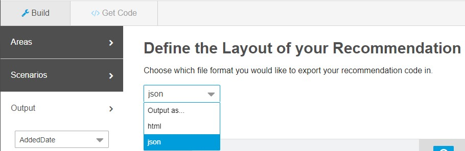

You should define what field values you want in your recommendation via the "Output" tab. Here you can add, remove and order the fields that will be available in your recommendation. Ordering has no impact if you choose to embed via JSON.

#### How the recommender knows who the current user is

The current user can be identified in 2 ways. The **first option** uses the cookie set by the **Collect Code** (collect.js). This might lead to other challenges given the browser initiatives to block third-party cookies (see CORS) and explains what `setFirstParty` is for. You might have to implement a proxy logic to accomodate this. If no cookie was set, generic recommendations are displayed.

**Important:** Make sure you run one of the trackXXX methods from collect.js before trying to see personalized recommendations. The setXXX methods alone do not set these cookies.

The **second option** uses the GET parameter `?email=INSERT_EMAIL_OR_UNIQUE_ID` (same you string you used for the Collect Code). Simply attach that to your `recommend.js` or `recommend.json` and you are good to go.

**Example for JSON:**

```javascript
GET https://INSERT_MID.recs.igodigital.com/a/v2/INSERT_MID/INSERT_PAGE_NAME/recommend.json?category=My%20Shoes&email=joern@foobar.com
```

#### Enhancing recommendation results

You can append parameters to the recommend.json / recommend.js as URL parameters to get more focused results. Please make sure you URL-Encode the values! Depending on the page name, these parameters are even shown to you on the "Get Code" tab.

| Page Name     | Default GET Parameter                        |
| ------------- | -------------------------------------------- |
| `category`    | `?category=INSERT_CATEGORY_NAME`             |
| `product`     | `?item=INSERT_SKU`                           |
| `cart`        | `?cart=INSERT_SKU1,INSERT_SKU2,INSERT_SKU3,...` <br>(separate SKUs with `,`) |
| `search`      | `?search=INSERT_SEARCH_TERM`                 |
| `home`        | _no parameter_                               |
| _custom name_ | _no parameter needed but optionally usable_  |

**List of available GET Parameters ([docs](https://help.salesforce.com/articleView?id=mc_pb_customize_the_calls.htm&type=5)):**

| Get Parameter | Definition |
| ------------- | ---------- |
| `item`        | This unique identifier for your product or content must match the unique key in the catalog and the value sent in the trackPageView collect item variable. This parameter is required to make a product- or content-based recommendation on any page. |
| `search`      | This _pipe_-delimited list contains search terms from your search page and matches the value sent in the trackPageView collect search variable. Example: `search=foo\|bar` |
| `category`    | This _pipe_-delimited list of categories matches both the values sent in the catalog feed and the value sent in the trackPageView collect category variable. Example: `search=shoes\|adults\|men` |
| `cart`        | This _pipe_-delimited list of products in the cart matches the trackCart collect item variable. |
| `wishlist`    | This _pipe_-delimited list of products in the customer's wishlist must match the trackWishlist collect items variable array. |
| `email`       | Use this parameter for faux-server-side, CloudPages, MobilePush, FaceBook tab, or some mobile apps. Pass the email address of the profile recommendation you want to access. The email value is the same value passed to Collect. If this value is a SubscriberKey, pass the SubscriberKey value. |
| `user_id`     | _Not verified:_ This parameter is used in testing or an advanced setup. It returns the cookie value from the profile containing the recommendations you want to access. |
| `item_count`  | Use this parameter to set the number of returned products or override the returned products setting per area. If you have multiple areas, define the numbers _pipe_-delimited (exampe of 4 areas: `item_count=1\|1\|1\|1` ensures only one item is returned for each) |
| `locale`      | This five-character value (e.g. `fr-FR`, `en-US`) indicates which localized content to display. [How to set up your Product Catalog for this](https://help.salesforce.com/articleView?id=mc_pb_localized_recommendations.htm&type=5). |

You may also combine two or more GET parameters (with an & sign, the questionmark is only used up front):

**Example for JSON:**

```javascript
GET https://INSERT_MID.recs.igodigital.com/a/v2/INSERT_MID/INSERT_PAGE_NAME/recommend.json?category=My%20Shoes&search=red%20female
```

**Example for HTML/JavaScript:**

```html
<!-- Copy this code right before the closing </body> of your INSERT_PAGE_NAME page-->
<script src="https://INSERT_MID.recs.igodigital.com/a/v2/INSERT_MID/INSERT_PAGE_NAME/recommend.js?category=My%20Shoes&search=red%20female"></script>
```

#### Embed via JSON

This requires you to do all the styling and processing yourself but also comes with greatest amount of flexibility. Call the below URL to get the JSON for your BU-Page combo:

```javascript
GET https://INSERT_MID.recs.igodigital.com/a/v2/INSERT_MID/INSERT_PAGE_NAME/recommend.json
```

**Example:**

```javascript
// example for web recommendation on 'product' page with SKU=12345 for BU=67890
GET https://67890.recs.igodigital.com/a/v2/67890/product/recommend.json?item=12345
```

**Handling CORS via JSONP - Cross-Origin-Ressource-Sharing the old way:**

If, naturally, you assumed that the JSON would come with proper CORS headers allowing to use this anywhere or that could be configured in some way to be limited to your website then, well, tough luck: It does not and you can't. Someone even decided it's a good idea to set `x-frame-options: SAMEORIGIN` response headers...

However, you can tell the JSON-version of the API to return its payload as a parameter to the callback instead to circumvent the issue. Bit old-fashioned if you ask me but effective.

```html
<script>
// define callback method; ensure it is defined in the GLOBAL scope!
window.myJsFunctionName = function(json) {
    // parse JSON response with your code here
}
</script>
```

Now, load the JavasScript-ified JSON. One way is to simply use another script tag:

```html
<script src="https://INSERT_MID.recs.igodigital.com/a/v2/INSERT_MID/INSERT_PAGE_NAME/recommend.json?callback=myJsFunctionName"></script>
```

If your framework has a good wrapper for JSONP then feel free to use that instead of static script-nodes like shown below. The following example uses [jQuery](https://jquery.com/):

```javascript
$.ajax({
    type: 'GET',
    url: 'https://INSERT_MID.recs.igodigital.com/a/v2/INSERT_MID/INSERT_PAGE_NAME/recommend.json',
    dataType: 'jsonp',
    jsonpCallback: 'myJsFunctionName',
    crossDomain: true
});
```

Either way, the content of recommend.json will be transformed to something like the following:

```javascript
// the content of recommend.json will turn into javascript
myJsFunctionName([{"name": "igdrec_1","empty": true}]);
```

**Important:** The Web Recommendations' "Get Code" tab was apparently only written with the "html" / JavaScript embed code in mind and falsely asks you to load the JSON via script-tag. It then continues to also ask you to include certain HTML. You need to ignore that and simply copy the url out of that snippet instead!

The URL per page (without parameter value) is provided on the "Get Code" tab, however that page is misleading in other ways:

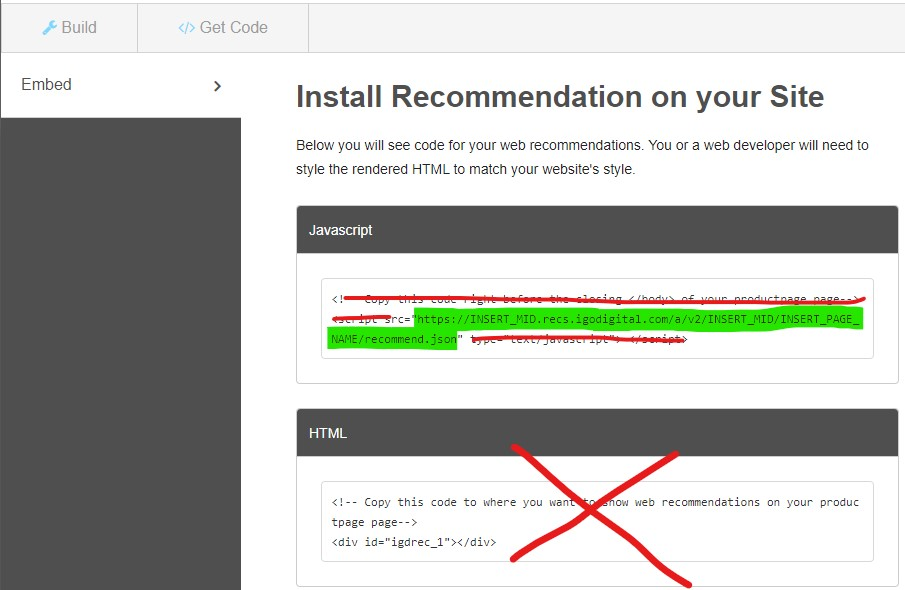

##### JSON Example responses

The following assumes only one recommendation area was defined and the default name "igdrec_1" was kept. Furthermore, the list of included fields was defined as "ProductLink", "ImageLink", "ProductName", "RegularPrice".

As long as recommendations are not ready, the API will return ab `empty:true` attribute per defined recommendation area:

```json
// no recommendation available yet
[
    {
        "name": "igdrec_1",
        "empty": true
    }
]
```

The reponse will look something like this once recommendations are actually available. Note that you define the area-`name` (e.g. by default "igdreg_x") and the number of `items` on the "Areas" tab. What scenarios are displayed first (if possible based on available data) is defined on the "Scenario" tab. If one or more scenarios are not possible to use yet, the system skips to the next one in your order or even falls back to "System Scenarios" (unless you specifically disabled that checkbox for the current page). Finally, the item-attributes (e.g. `link`, `regular_price`, ...) are defined for all areas of a page at once on the "Output" tab.

```json
// (some) recommendation returned for a page with 3 defined areas

[ // list of areas, corresponding to scenario ordering
    {
        "name": "igdrec_1", // Name of Area #1
        "title": "Popular Items Today", // title of 1st available scenario
        "priority": 1,
        "items": [
            {
                "link": "Link",
                "image_link": "Image link",
                "name": "Name",
                "regular_price": 112.0
            },
            {
                "link": "Link",
                "image_link": "Image link",
                "name": "Name",
                "regular_price": 412.0
            }
        ]
    },
    {
        "name": "igdrec_2", // Name of Area #2
        "title": "Most Viewed Items", // title of 2nd available scenario
        "priority": 2,
        "items": [
            {
                "link": "Link",
                "image_link": "Image link",
                "name": "Name",
                "regular_price": 212.0
            },
            {
                "link": "Link",
                "image_link": "Image link",
                "name": "Name",
                "regular_price": 312.0
            }
        ]
    },
    {
        "name": "igdrec_3", // Name of Area #3
        "empty": true // no further recommendation available yet
    }
]
```

#### Embed via JavaScript ("HTML")

You will be asked to load a JavaScript file like this:

```html
<!-- Copy this code right before the closing </body> of your INSERT_PAGE_NAME page-->
<script src='https://INSERT_MID.recs.igodigital.com/a/v2/INSERT_MID/INSERT_PAGE_NAME/recommend.js'></script>
```

As well as position some HTML where you want the final recommendation to be inserted like this:

```html
<!-- Copy this code to where you want to show web recommendations on your INSERT_PAGE_NAME page-->
<div id='igdrec_1'></div>
```

This second part will vary depending on your choices made on the "Build">"Areas" tab.

##### JavaScript/HTML example code

As long as **recommendations are not ready** the code of `recommend.js` will be missing the crucial part that actually fills in the recommendation.

```javascript
// recommend.js if recommendations are not ready yet and only one area named "idgrec_1" was defined for this page

function display_INSERT_PAGE_NAME(zone, id) {
    if (id === 'igdrec_1') {
          zone.innerHTML = '';
    }
}

function addLoadEvent(func) {
    var oldonload = window.onload;
    if (typeof window.onload != 'function') {
        window.onload = func;
    } else {
        window.onload = function() {
            if (oldonload) {
                oldonload();
            }
            func();
        }
    }
}

function callREC() {
    var pageZone = document.getElementById('igdrec_1');
    if ( undefined != pageZone) {
        display_INSERT_PAGE_NAME(pageZone, 'igdrec_1');
    }
}

callREC();
```

**Note:** the method `display_INSERT_PAGE_NAME()` will be named according to your page: If you named the page "MyTest" the method will be named `display_MyTest()`.

If you defined more than one recommendation area, the code will be auto-extended to match that:

```javascript
// recommend.js if recommendations are not ready yet and two areas named "idgrec_1" and "idgrec_2" were defined for this page

function display_INSERT_PAGE_NAME(zone, id) {
    if (id === 'igdrec_1') {
        zone.innerHTML = '';
    }
    if (id === 'igdrec_2') {
        zone.innerHTML = '';
    }
}

function addLoadEvent(func) {
    var oldonload = window.onload;
    if (typeof window.onload != 'function') {
        window.onload = func;
    } else {
        window.onload = function() {
            if (oldonload) {
                oldonload();
            }
            func();
        }
    }
}

function callREC() {
    var pageZone = document.getElementById('igdrec_1');
    if ( undefined != pageZone) {
        display_INSERT_PAGE_NAME(pageZone, 'igdrec_1');
    }
    var pageZone = document.getElementById('igdrec_2');
    if ( undefined != pageZone) {
        display_INSERT_PAGE_NAME(pageZone, 'igdrec_2');
    }
}

callREC();
```

The reponse will look something like this **once recommendations are actually available**. The only difference is that the `zone.innerHTML`-line now gets the actual HTML set, pre-rendered on the server without further callouts:

```javascript
// recommend.js if recommendations are finally ready and only one area named "idgrec_1" was defined for this page with 2 items returned

function display_INSERT_PAGE_NAME(zone, id) {
    if (id === 'igdrec_1') {
        // NOTE: main difference is that zone.innerHTML actually gets a value
        zone.innerHTML = "  <div class='igo_boxhead'><h2>Most Viewed Items</h2></div>  <div class='igo_boxbody'><div class='igo_product'><a href='https://INSERT_MID.collect.igodigital.com/redirect/v3Q_SOME_BASE64_ENCODED_AND_ENRRYPTED_STRING_HERE_ZGYyNw=='>banana</a><a href='https://INSERT_MID.collect.igodigital.com/redirect/v3Qk_SOME_BASE64_ENCODED_AND_ENRRYPTED_STRING_HERE_ZGYyNw=='></a><div class='igo_product_product_name'><span class='igo_product_product_name_label'>Product Name:</span><span class='igo_product_product_name_value'>banana</span></div><div class='igo_product_regular_price'><span class='igo_product_regular_price_label'></span><span class='igo_product_regular_price_value'>$12.30</span></div></div><div class='igo_product last_rec'><a href='https://INSERT_MID.collect.igodigital.com/redirect/v3Q_SOME_BASE64_ENCODED_AND_ENRRYPTED_STRING_HERE_iYjNhOQ=='>banana</a><a href='https://INSERT_MID.collect.igodigital.com/redirect/v3Q_SOME_BASE64_ENCODED_AND_ENRRYPTED_STRING_HERE_iYjNhOQ=='></a><div class='igo_product_product_name'><span class='igo_product_product_name_label'>Product Name:</span><span class='igo_product_product_name_value'>banana</span></div><div class='igo_product_regular_price'><span class='igo_product_regular_price_label'></span><span class='igo_product_regular_price_value'>$12.30</span></div></div>  </div>";
    }
}

function addLoadEvent(func) {
    var oldonload = window.onload;
    if (typeof window.onload != 'function') {
        window.onload = func;
    } else {
        window.onload = function() {
            if (oldonload) {
                oldonload();
            }
            func();
        }
    }
}

function callREC() {
    var pageZone = document.getElementById('igdrec_1');
    if ( undefined != pageZone) {
        display_INSERT_PAGE_NAME(pageZone, 'igdrec_1');
    }
}

callREC();
```

The HTML that will be created for you will look something like the following:

```html
<div class="igo_boxhead"><h2>Most Viewed Items</h2></div>
<div class="igo_boxbody">
    <div class="igo_product">
        <a
            href="https://INSERT_MID.collect.igodigital.com/redirect/v3Q_SOME_BASE64_ENCODED_AND_ENRRYPTED_STRING_HERE_ZGYyNw=="
            >banana</a
        ><a
            href="https://INSERT_MID.collect.igodigital.com/redirect/v3Qk_SOME_BASE64_ENCODED_AND_ENRRYPTED_STRING_HERE_ZGYyNw=="
            ></a>
        <div class="igo_product_product_name">
            <span class="igo_product_product_name_label">Product Name:</span
            ><span class="igo_product_product_name_value">banana</span>
        </div>
        <div class="igo_product_regular_price">
            <span class="igo_product_regular_price_label"></span
            ><span class="igo_product_regular_price_value">$12.30</span>
        </div>
    </div>
    <div class="igo_product last_rec">
        <a
            href="https://INSERT_MID.collect.igodigital.com/redirect/v3Q_SOME_BASE64_ENCODED_AND_ENRRYPTED_STRING_HERE_iYjNhOQ=="
            >banana</a
        ><a
            href="https://INSERT_MID.collect.igodigital.com/redirect/v3Q_SOME_BASE64_ENCODED_AND_ENRRYPTED_STRING_HERE_iYjNhOQ=="
            ></a>
        <div class="igo_product_product_name">
            <span class="igo_product_product_name_label">Product Name:</span
            ><span class="igo_product_product_name_value">banana</span>
        </div>
        <div class="igo_product_regular_price">
            <span class="igo_product_regular_price_label"></span
            ><span class="igo_product_regular_price_value">$12.30</span>
        </div>
    </div>
</div>

```

### Debugging Web Recommendations

Once you have created a page and start seeing recommendations come in you might wonder why things are displayed the way they are. An easy way to dig deeper is to the `recommend.js` or `recommend.json` URL that the Get Code tab shows you and change the ending to `recommend.explain`. That shows you a whole lot more output all the sudden and lets you analyze whats happening.

Example call:

```javascript
GET https://INSERT_MID.recs.igodigital.com/a/v2/INSERT_MID/INSERT_PAGE_NAME/recommend.explain
```

Example response:

```json
{
    "scenarios": [
        {
            "name": "topenjoyed",
            "code": "Home_TopEnjoyed",
            "score": 990,
            "getmores": 1,
            "for_target": "OurMostBoughtProducts",
            "items": [
                "ABC-93710600001",
                "ABC-86594971",
                "ABC-94212000003"
            ],
            "filters": [],
            "status": "returned"
        },
        {
            "name": "topenjoyed",
            "code": "Home_TopEnjoyed",
            "score": 900,
            "getmores": 1,
            "for_target": "InSeason",
            "items": ["ABC-87847461", "ABC-87843491", "ABC-87847471"],
            "filters": [],
            "status": "returned"
        },
        {
            "name": "topenjoyed",
            "code": "Home_TopEnjoyed",
            "score": 800,
            "getmores": 1,
            "for_target": "NewProducts",
            "items": [
                "ABC-19025001",
                "ABC-87906121",
                "ABC-24690301"
            ],
            "filters": [],
            "status": "returned"
        },
        {
            "name": "topenjoyed",
            "code": "Home_TopEnjoyed",
            "score": 700,
            "getmores": 2,
            "for_target": "MostRelevantPromotedProducts",
            "items": [
                "ABC-35926501",
                "ABC-30965601",
                "ABC-22645201"
            ],
            "filters": [],
            "status": "returned"
        },
        {
            "name": "topsellers",
            "code": "Home_MostPopular",
            "score": 1000,
            "getmores": 2,
            "for_target": "OurMostBoughtProducts",
            "items": [],
            "filters": [],
            "status": "rejected"
        },
        {
            "name": "topsellers",
            "code": "Home_MostPopular",
            "score": 920,
            "getmores": 2,
            "for_target": "InSeason",
            "items": [],
            "filters": [],
            "status": "rejected"
        },
        {
            "name": "topviews",
            "code": "Home_MostViewed",
            "score": 910,
            "getmores": 2,
            "for_target": "InSeason",
            "items": [
                "ABC-89673861",
                "ABC-88148871",
                "ABC-99403401050"
            ],
            "filters": [],
            "status": "rejected"
        },
        {
            "name": "topsellers",
            "code": "Home_MostPopular",
            "score": 820,
            "getmores": 2,
            "for_target": "NewProducts",
            "items": [],
            "filters": [],
            "status": "rejected"
        },
        {
            "name": "topviews",
            "code": "Home_MostViewed",
            "score": 810,
            "getmores": 2,
            "for_target": "NewProducts",
            "items": [
                "ABC-89673861",
                "ABC-88148871",
                "ABC-99403401050"
            ],
            "filters": [],
            "status": "rejected"
        },
        {
            "name": "topsellers",
            "code": "Home_MostPopular",
            "score": 720,
            "getmores": 2,
            "for_target": "MostRelevantPromotedProducts",
            "items": [],
            "filters": [],
            "status": "rejected"
        },
        {
            "name": "topviews",
            "code": "Home_MostViewed",
            "score": 710,
            "getmores": 2,
            "for_target": "MostRelevantPromotedProducts",
            "items": [
                "ABC-89673861",
                "ABC-88148871",
                "ABC-99403401050"
            ],
            "filters": [],
            "status": "rejected"
        },
        {
            "name": "topgrossing",
            "code": "Home_TopGrossing",
            "score": 1,
            "getmores": 0,
            "for_target": null,
            "items": null,
            "filters": [],
            "status": "available"
        },
        {
            "name": "topviews",
            "code": "Home_MostViewed",
            "score": 1,
            "getmores": 0,
            "for_target": null,
            "items": null,
            "filters": [],
            "status": "available"
        },
        {
            "name": "topsellers",
            "code": "Home_MostPopular",
            "score": 1,
            "getmores": 0,
            "for_target": null,
            "items": null,
            "filters": [],
            "status": "available"
        }
    ],
    "filters": [
        {
            "type": "emphasize_tags",
            "params": [{}],
            "block_given?": false,
            "priority": 0,
            "waslocal": true,
            "excluded_skus": null
        },
        {
            "type": "exclude",
            "params": [{ "ct": ["asset", "content", "banner"] }],
            "block_given?": false,
            "priority": 0,
            "waslocal": true,
            "excluded_skus": []
        }
    ],
    "divs": [
        { "size": "1..16", "target": "OurMostBoughtProducts" },
        {
            "size": "1..16",
            "target": "InSeason",
            "filters": [
                {
                    "type": "include",
                    "params": [{ "st": "Christmas" }, null],
                    "block_given?": false,
                    "priority": 0,
                    "waslocal": true,
                    "excluded_skus": [
                        "ABC-94212300001",
                        "ABC-46054901",
                        "ABC-32529101",
                        "ABC-87906081",
                        "ABC-54878201"
                    ]
                }
            ]
        },
        {
            "size": "1..16",
            "target": "NewProducts",
            "filters": [
                {
                    "type": "include",
                    "params": [{ "ne": "Y" }, null],
                    "block_given?": false,
                    "priority": 0,
                    "waslocal": true,
                    "excluded_skus": [
                        "ABC-89673861",
                        "ABC-88148871",
                        "ABC-99403401050",
                        "ABC-87879261",
                        "ABC-87842451"
                    ]
                }
            ]
        },
        {
            "size": "1..16",
            "target": "MostRelevantPromotedProducts",
            "filters": [
                {
                    "type": "include",
                    "params": [{ "ioo": "Y" }, null],
                    "block_given?": false,
                    "priority": 0,
                    "waslocal": true,
                    "excluded_skus": [
                        "ABC-87842441",
                        "ABC-87884171",
                        "ABC-93710500001",
                        "ABC-87905821",
                        "ABC-87842491",
                        "ABC-87842451"
                    ]
                }
            ]
        }
    ],
    "errors": [],
    "weights": {},
    "page": "general",
    "referer": null
}
```

## Embedding Collect Code via Google Tag Manager (GTM)

There are multiple ways of achieving an integration, but given that you are looking at a tag manager, you are likely including multiple trackers in your page.
In this scenario, you will want to dive deep into Google's [Ecommerce (GA4) Developer Guide](https://developers.google.com/tag-manager/ecommerce-ga4). There is also the **deprecated** [Enhanced Ecommerce (UA) Developer Guide](https://developers.google.com/tag-manager/enhanced-ecommerce) - please disregard this document in favor of the newer "GA4" version.

> _Optional read:_ You may want to understand the [Enhanced Ecommerce GA Developer Guide](https://developers.google.com/analytics/devguides/collection/analyticsjs/enhanced-ecommerce) which describes how to enable the measurement of user interactions with products on ecommerce websites across the user's shopping experience in **Google Analytics** (GA). While you of course do not need to use GA together with Einstein, it does explain the underlying concepts.

While we are looking at prerequisites, please also pay attention to Google's [definition of "triggers"](https://support.google.com/tagmanager/answer/7679316?hl=en) and their [defintion of tags](https://support.google.com/tagmanager/answer/3281060?hl=en&ref_topic=3281056).

For SFMC's Collect Code, you will need to understand [Custom Tags](https://support.google.com/tagmanager/answer/6107167?hl=en&ref_topic=3281056).

### Loading the GTM library

First off, let's make sure GTM is loaded on your website. You will need to go to [Google Tag Manager](https://tagmanager.google.com/) and select your Account (1), or alternatively [create a new Account](https://tagmanager.google.com/#/admin/accounts/create) (2).

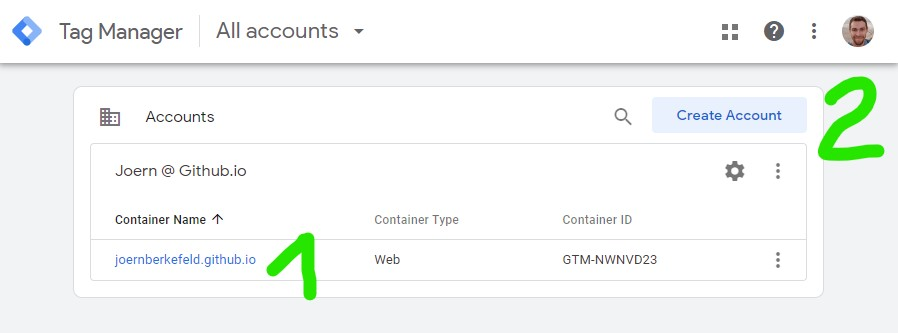

Either way, you end up with the Container ID (starting with "GTM-"). Now, we switch over to GTM's own Quick Start Guide which at the time of writing, asks you to complete the following 2 steps in your website:

1. Copy the following JavaScript and paste it as close to the opening <head> tag as possible on every page of your website, replacing GTM-XXXX with your container ID:

```html
<!-- Google Tag Manager -->
<script>(function(w,d,s,l,i){w[l]=w[l]||[];w[l].push({'gtm.start':
new Date().getTime(),event:'gtm.js'});var f=d.getElementsByTagName(s)[0],
j=d.createElement(s),dl=l!='dataLayer'?'&l='+l:'';j.async=true;j.src=
'https://www.googletagmanager.com/gtm.js?id='+i+dl;f.parentNode.insertBefore(j,f);
})(window,document,'script','dataLayer','GTM-XXXX');</script>
<!-- End Google Tag Manager -->
```

2. Copy the following snippet and paste it immediately after the opening <body> tag on every page of your website, replacing GTM-XXXX with your container ID:

```html
<!-- Google Tag Manager (noscript) -->
<noscript><iframe src="https://www.googletagmanager.com/ns.html?id=GTM-XXXX"
height="0" width="0" style="display:none;visibility:hidden"></iframe></noscript>
<!-- End Google Tag Manager (noscript) -->
```

### Loading collect.js via GTM

After selecting/creating a GTM account in the previous step, find "Tags" in the navigation and then click on **Create** by clicking on the upper tile, ignoring the lower "Triggering" tile.

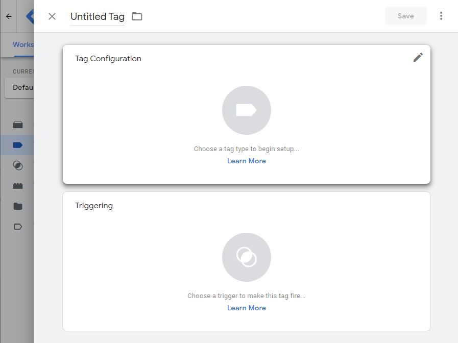

The "Choose tag type" dialogue pops up. Scroll down until you find the Custom section and click on "Custom HTML":


Now you can configure all relevant details of ur library-loading tag:

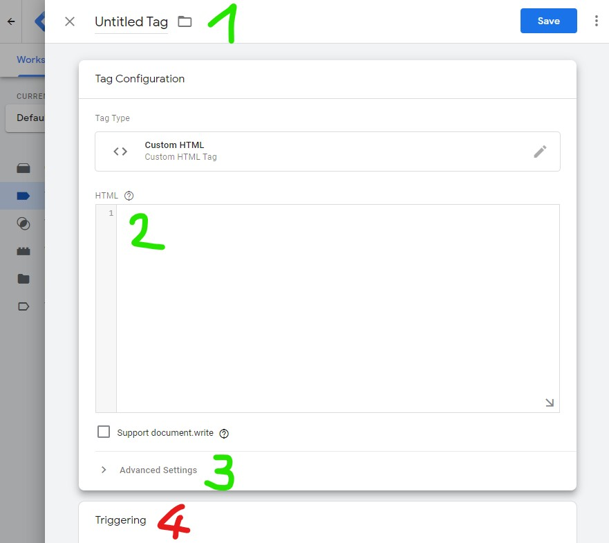

1. Change the name from "Untitled Tag" to "Collect.js loader" (or whatever suits you).
2. Go fetch the code from _Initialize the library_ > _[Asynchronous Collect Code](#asynchronous-collect-code)_ section above. and paste it into the "HTML" textarea.
   > **Important**: make sure you replace `INSERT_MID` with your BU's MID in 2 places in this snippet!
3. click on "Advanced Settings" which pops up the below additional interface and ensure "Tag firing options" is set to "Once per page".
   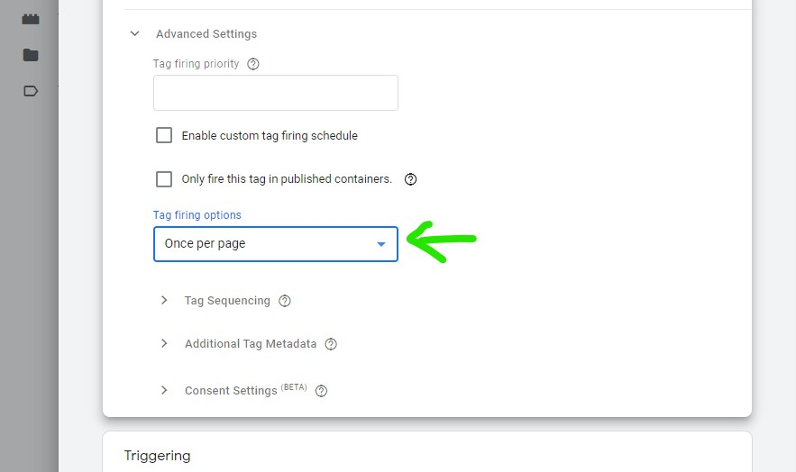
4. Ignore the "Triggering" section for this tag. We will load it through the actual events.

When you are done the tag should look like this:

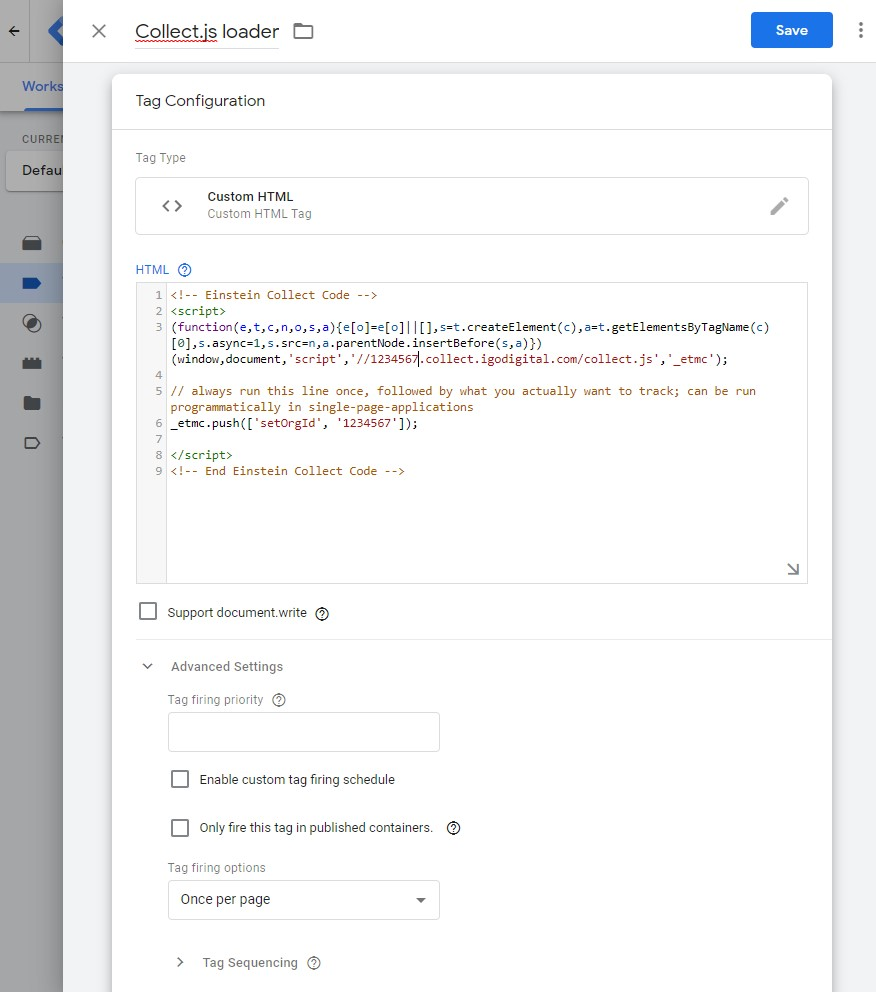

While saving the system might ask you to add a trigger - **Do not add a trigger here** but instead simply save the tag. We will ensure it's loaded later.

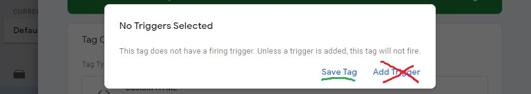

#### GTM: Developer Playground

For early testing and especially if you don't have access to it on your SFMC instance just yet, you may replace the URL of the loader from `'//1234567.collect.igodigital.com/collect.js'` to `'https://joernberkefeld.github.io/SFMC-Cookbook/einstein/recommendation/collect-code/default/collect.js'`. This probably won't actually log anything but you can check in your browser DevTools's network tab if the right type of callouts are made without actually having access to Marketing Cloud.

### Logging events via GTM

With collect.js loading prepared, you may now start creating more custom tags, one for each event you want to be able to log for Einstein. Make sure you understood how to actually log events of all kinds via GTM and then simply hook up your new custom tags to those triggers.


#### Identify current user via GTM

In you website you want to trigger an event that is then caught by the triggers you specified in GTM for a certain tag. First, we need to define the variable that we want to log - unless it's one of the default ones of course. For our user login, let us create a custom Data Layer variable called `userId`:


This variable can then be used when writing into the data layer on the website and referenced in our Custom HTML Tag:

**Website Code:**

```html
<script>
dataLayer.push({
  'userId': 'my.personal@email.com',
  'event': 'identifyUser'
});
</script>
```

**Your Custom HTML Tag:**

```html
<script>
_etmc.push(['setUserInfo', {'email': {{userid}} }]);

// run a generic trackPageView once to set cookies that are necessary for personalized Web Recommendations to show up
_etmc.push(['trackPageView']);
</script>
```

Putting that all together it will look something like this for the tag:

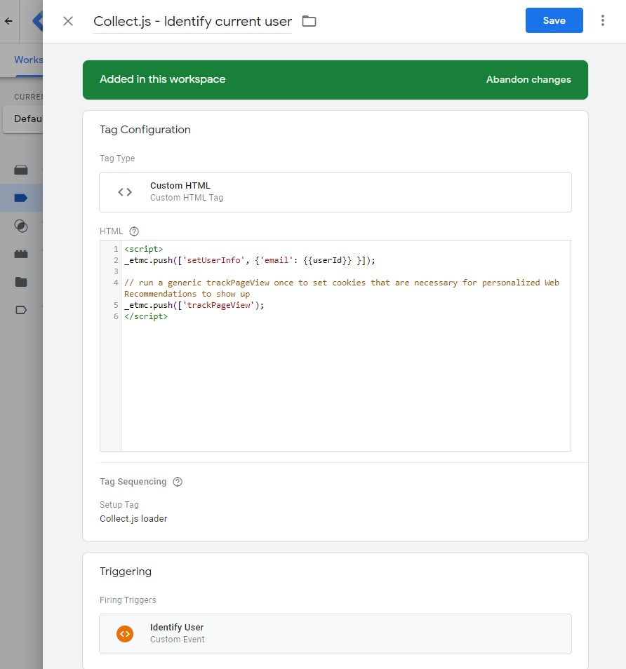

And like this for the trigger that you will need to create as a "Custom Event", based on the event name you used in the website code. In this example that event is called `identifyUser`:

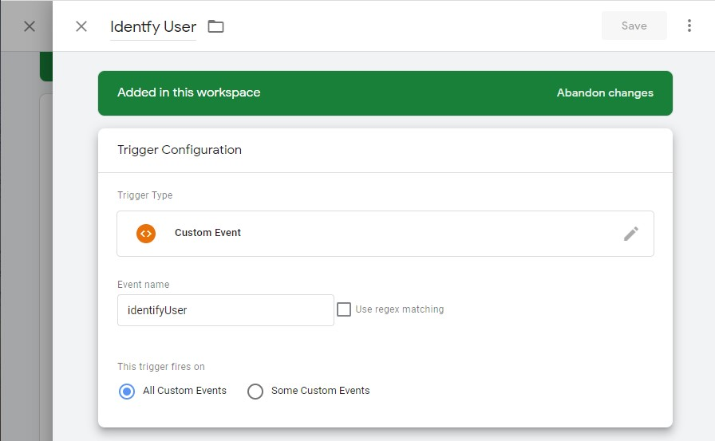

Now, finally, we **need** to ensure our collect.js library is actually loaded. That is done in the Advanced Settings of the Custom HTML Tag that we just created (named "Collect.js - Identify current user").

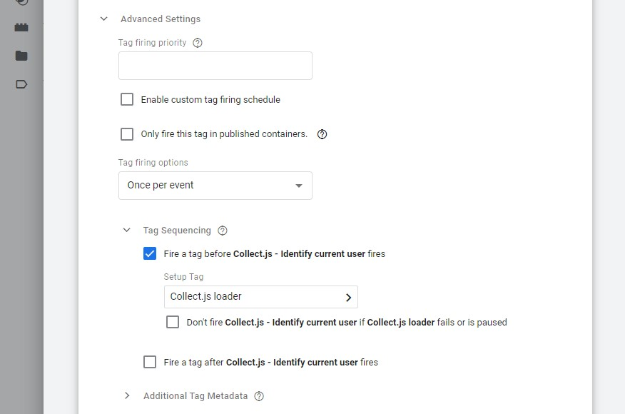

Ensure that for the option "Fire a tag **before**" you select the first tag we create earlier. That way, our library is really only loaded if events occur. And since it supports queueing events, loading it only now won't have a negative effect on whats loaded, nor on performance.

### Debugging / Previewing your GTM setup

Make sure to go through [Loading the GTM library](#loading-the-gtm-library) for the page you intend to test this on (unless you are just updating a previous setup). If the GTM library is loading fine, you can now try the white **Preview** button in the top right corner. This will open up **Tag Assistant** which should ask you to provide the URL of your page. Once given, Tag Assistant will open a new window (or new tab) with that link and try to "connect". That way, whatever changes you made will be usable in a save environment while normal users continue to use the last released ("submitted") version.

### Publishing your changes

When things look good, do make sure you actually publish your changes! You can do so by hitting the blue **Submit** button which should be in the top right corner of every GTM page. Unless you do this, none of your changes will be live!

### Events mapping: Collect Code to GA4 Retail/Ecommerce

> The most current list of GA Events can be found in the [Analytics Help](https://support.google.com/analytics/answer/9268036).

The following table aims to show how events are tracked in comparison to each other. Please note that SFMC can track additional events (marked with '-' below) using `trackEvent` method, however, this would not have an impact on Einstein Recommendations.

Also, Google's `add_to_cart` and `remove_from_cart` only take the items actually added/removed, SFMC's Collect code, however, requires you to use `trackCart` for both events and to pass in all items that remain in the cart after the event.

**Events missing in GA:**

- [Insite search](#track-page-views-trackpageview)
- [User Log in](#identify-current-user)
- [User Log out](#identify-current-user)

Also don't forget about `setOrgId` that needs to run on page load and `doNotTrack` after login / as soon as we know.

| SFMC Event | GA4 Event | Trigger | GA Parameters |
| -- | -- | -- | -- |
| _trackEvent_ | add_payment_info | when a user submits their payment information | coupon, currency, items, payment_type, value |
| _trackEvent_ | add_shipping_info | when a user submits their shipping information | coupon, currency, items, shipping_tier, value |
| trackCart | add_to_cart | when a user adds items to cart | currency, items, value |
trackWishlist | add_to_wishlist | when a user adds items to a wishlist | currency, items, value |
| _trackEvent_ | begin_checkout | when a user begins checkout | coupon, currency, items, value |
| _trackEvent_ | generate_lead | when a user submits a form or request for information | value, currency |
| trackConversion<br>trackCart.clear_cart | purchase | when a user completes a purchase | affiliation, coupon, currency, items, transaction_id, shipping, tax, value |
| _trackEvent_ | refund | when a refund is issued | affiliation, coupon, currency, items, transaction_id, shipping, tax, value |
trackCart<br>trackCart.clear_cart | remove_from_cart | when a user removes items from a cart | currency, items, value |
| _trackEvent_ | select_item | when an item is selected from a list | items, item_list_name, item_list_id |
| _trackEvent_ | select_promotion | when a user selects a promotion | items, promotion_id, promotion_name, creative_name, creative_slot, location_id |
| _trackPageView_ | view_cart | when a user views their cart | currency, items, value |
trackPageView.item | view_item | when a user views an item | currency, items, value |
| trackPageView.category | view_item_list | when a user sees a list of items/offerings | items, item_list_name, item_list_id |
| _trackPageView_ | view_promotion | when a promotion is shown to a user | items, promotion_id, promotion_name, creative_name, creative_slot, location_id |
| doNotTrack | _probably best to handle in application layer and avoid loading collect.js at all_ | - | - |
| setUserInfo | _see [Identify current user via GTM](#identify-current-user-via-gtm) above_ | - | - |
