# Encryption in Marketing Cloud

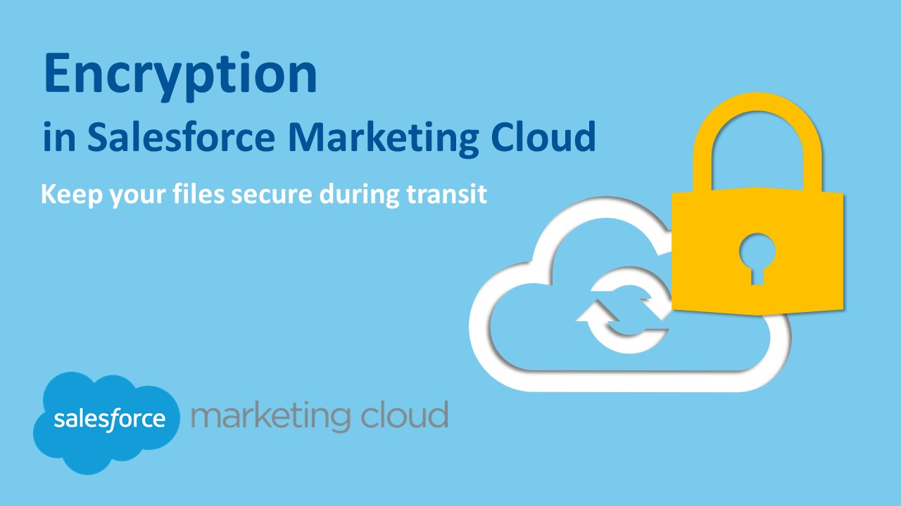

- [Keys](#keys)
  - [Creating PGP / GPG keys](#creating-pgp--gpg-keys)
  - [Importing PGP / GPG keys into SFMC's Key Manager](#importing-pgp--gpg-keys-into-sfmcs-key-manager)
- [De- and encrypting things in SFMC](#de--and-encrypting-things-in-sfmc)
  - [Encrypting files to be shared via SFTP](#encrypting-files-to-be-shared-via-sftp)
  - [Decrypting files incoming via SFTP](#decrypting-files-incoming-via-sftp)

## Keys

If you want to import files but not transfer unencrypted data, Marketing Cloud offers their own public key that you can use to encrypt the files before transferring them via SFTP. This public key file is [available here for download](https://members.exacttarget.com/Content/Subscribers/SubsLists/publickey.txt). If you want to have greater control, you can create your own PGP/GPG key to de- and encrypt your data and import them into Marketing Cloud using Key Manager.

### Creating PGP / GPG keys

For beginners, this might be challening to do because first of all you need to create keys (yes, plural) that Marketing Cloud accepts and then you have to understand how exactly to import them into Key Manager.

PGP / GPG uses an assymetric method which means there is one key for encryption (the **public key**) and another for decryption (the **private key**, sometimes also named the **secret key**).

Download and install the [GPG command line tools](https://www.gnupg.org/download/#binary) for your system and you are good to go.

> If you are a Windows user, get a software like [Gpg4win](https://www.gpg4win.org/) which comes with the command line tool `gpg` plus a GUI named `Kleopatra` that lets you de- or encrypt files with a nice visual interface and right from Windows Explorer's right-click-menu.
>
> For Mac users [GPG Tools](https://gpgtools.org/) is a good option. Other users will find a tool under the above link.

In any case you should end up with the new command `gpg` in your terminal/bash:

1. Open Terminal
2. Generate a key pair by entering `gpg --full-generate-key`
3. Select "RSA and RSA" (should be option 1)
4. Specify the key length to be `4096`
   > If you go with the default (currently 3072) instead, SFMC will prompt you with an error during creation.
5. Enter the length of time the key should be valid.
6. Now, enter your name and email
   > For other use-cases it might matter more what you enter here but in the context of SFMC this could be something generic.
7. Optionally type a secure passphrase (recommended).
8. Get the key ID of your newly generated key with:
   `gpg --list-secret-keys --keyid-format=long`
   > 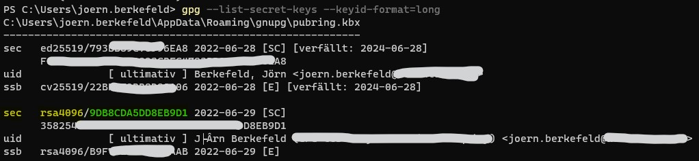
   > In the above example, the key you are looking for is `9DB8CDA5DD8EB9D1`. You can find it by looking for the prefix `sec rsa4096` (I marked it yellow & green in the screenshot).
9. Save your newly created **public key** as a file:
    `gpg --output public.asc --armor --export 9DB8CDA5DD8EB9D1`
    > Make sure you replace `9DB8CDA5DD8EB9D1` with the key id you found!
10. Save your newly created **private key** as a file:
    `gpg --output private.pgp --armor --export-secret-key 9DB8CDA5DD8EB9D1`
    > Make sure you replace `9DB8CDA5DD8EB9D1` with the key id you found!

Proceed to importing one or both of these keys into SFMC's Key Manager.

### Importing PGP / GPG keys into SFMC's Key Manager

Key Manager can be found under `Setup > Administration > Data Management` and it allows you to store all clients of keys for various different purposes. From setting up SSO, using AMPscript's EncryptSymmetric / DecryptSymmetric methods up to encrypting files via PGP or GPG.

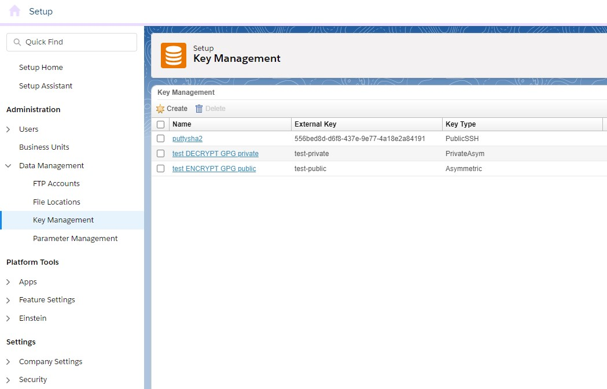

Click on "Create" to open the below form. Make sure to select _Key Type_ "Asymmetric" and then decide what you need to upload. If you want to be able to **decrypt** files in SFMC that were encoded with your key and then stored in your SFTP, then please upload the **public key** (_Private Key_ checkbox kept unchecked!).

If you want to **encrypt** files in SFMC before you store them on your SFTP for extraction by users or an integration, then upload the **private key** (_Private Key_ checkbox kept checked!). If you set up a passphrase to secure your private key, you have to enter it in the extra input field that appears. If you did not set up a passphrase just leave this empty.

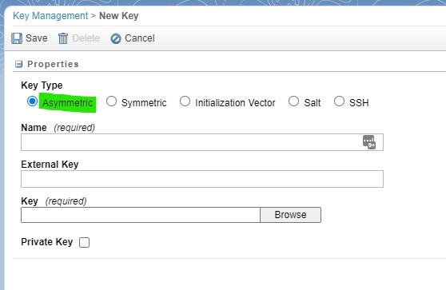

Choose the name wisely in case you have more than one key eventually. SFMC will only show you public or private key in Automation Studio depending on the task at hand but it will be easier for you if you give it descriptive names here, including the words "public" or "private".

Once you are done, you will see them listed like in the aboth screenshot. When clicking on the public key you get a lot of info about it while a click on the private key reveals nothing - not even the file name you uploaded.

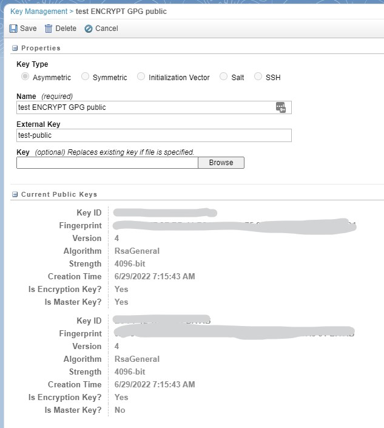

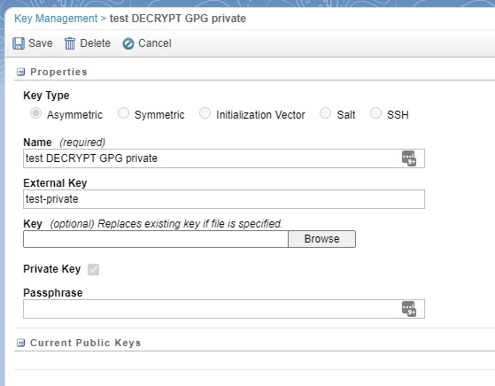

## De- and encrypting things in SFMC

### Encrypting files to be shared via SFTP

Once the key **public key** is set up you can create an Automation to export data from a DataExtension and have the data written into a CSV that is then encrypted. The automation only needs 2 steps to do so: Data Extract followed by a File Transfer.

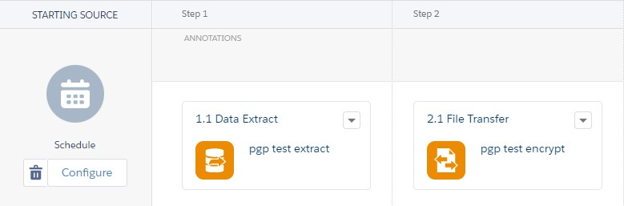

The first step is rather straight forward. Choose any file name you like (e.g. `pgp-extract-%%Year%%-%%Month%%-%%Day%%.csv`).
Second, we set up the File Transfer to move the just exported file from the Safehouse to a file location of our choosing. I opted for the export/ folder in the below example:

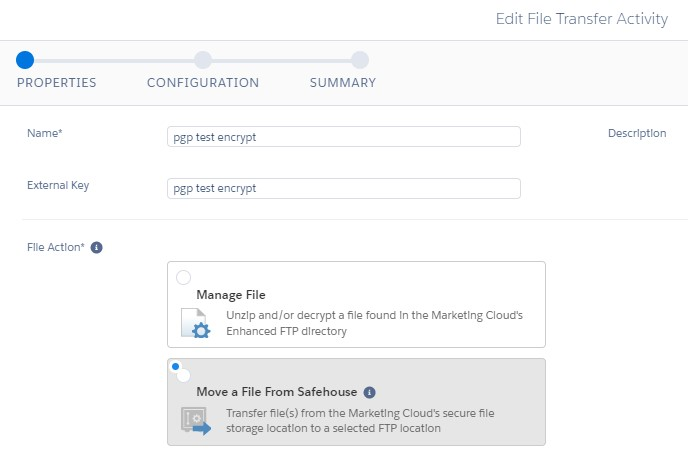

Make sure the File Name Pattern matches the same oyu entered in the Data Extract:

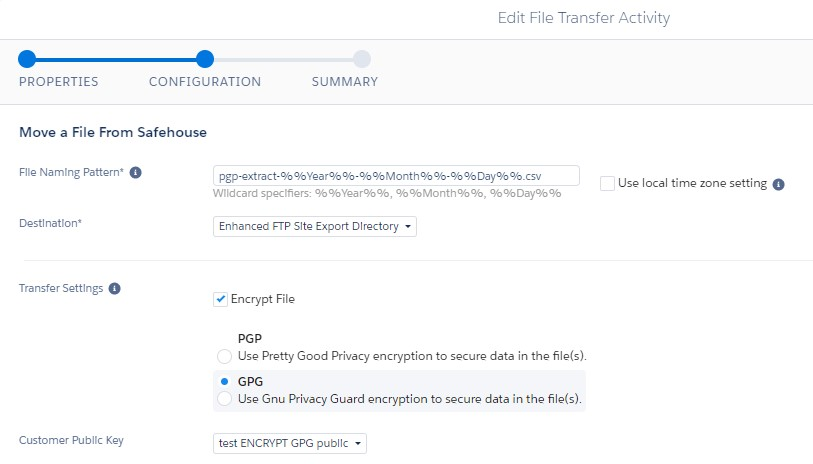

And thats it - instead of `pgp-extract-%%Year%%-%%Month%%-%%Day%%.csv` you will find `pgp-extract-%%Year%%-%%Month%%-%%Day%%.csv.gpg` in your folder which can then be decoded using your **private key** on the receiving end.

### Decrypting files incoming via SFTP

To decrypt incoming files, you will need the **private key** in your key manager that matches the public key used for encrypting them!

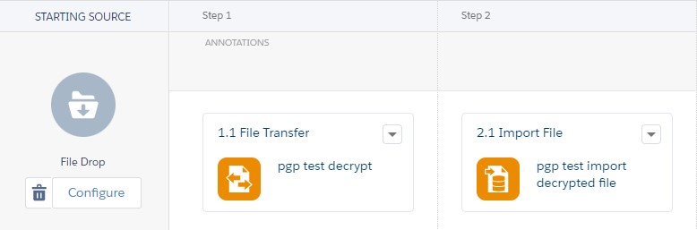

First, you need to set up a file drop activity (or a schedule, if you prefer) and then define the file transfer that will handle decryption.
This time, choose "Manage File" to get to the decryption options on the following page.

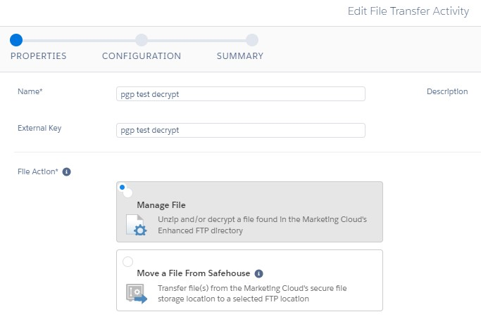

Make sure you selected "Decrypt file" and then select the right **private key** for it. The File Naming Pattern should match what you have set up in the File Drop entry event. You can make your life easier by typing in %%FILENAME_FROM_TRIGGER%% instead.

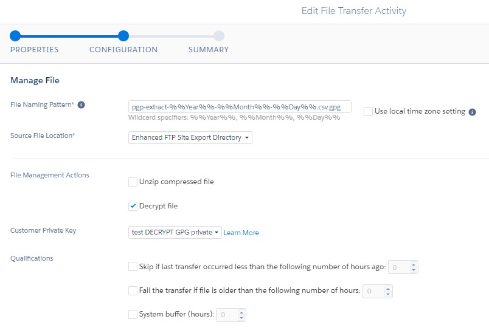

Next up is the import file activity. Make sure that you set up the file name pattern without the trailing ".gpg" because this activity works with the decoded result from the file transfer that ran before.

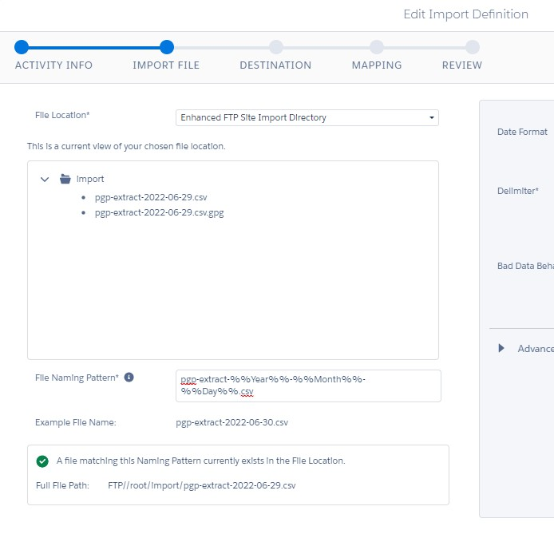

The rest is basically standard. Choose the target DataExtension and set up field-column mapping accordingly.